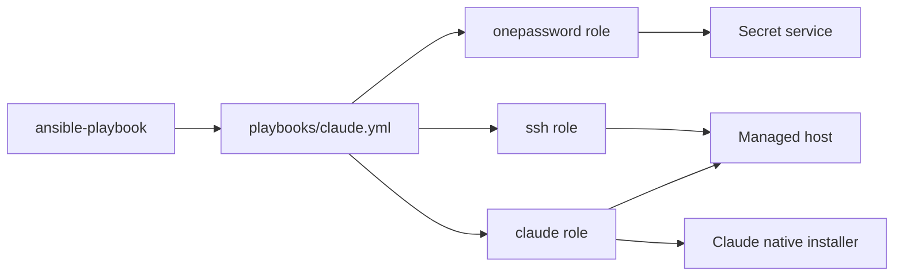
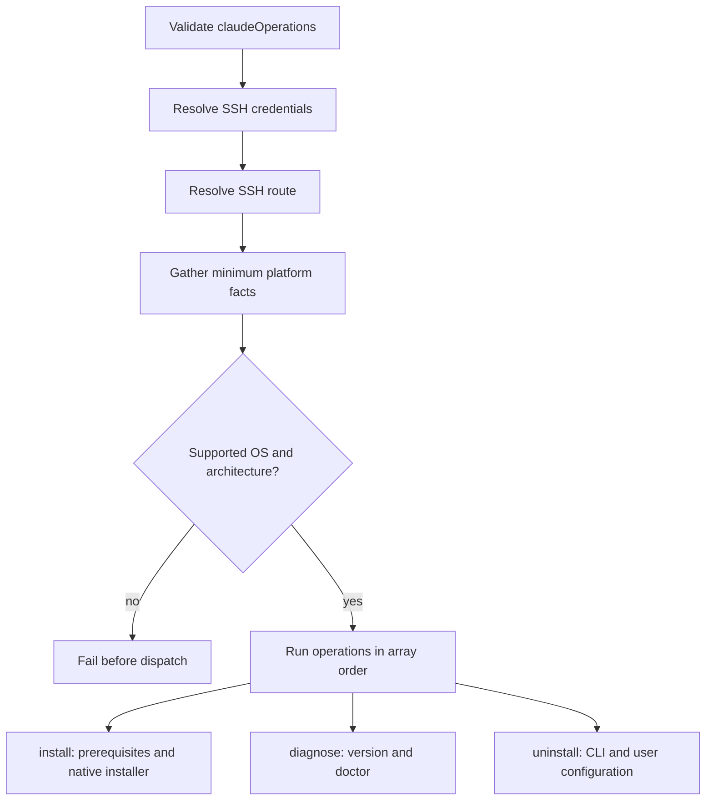

# Claude CLI

## Scope

[`playbooks/claude.yml`](../../playbooks/claude.yml) and
[`roles/claude`](../../roles/claude) manage Claude Code through the ordered,
non-empty `claudeOperations` array. Array order is execution order.

| Operation | Result |
| --- | --- |
| `install` | Install Claude Code with Anthropic's native installer. |
| `diagnose` | Print `claude --version` and `claude doctor`. |
| `uninstall` | Remove Claude Code and the login user's Claude configuration. |

### Supported Hosts

| OS family | Architectures |
| --- | --- |
| `Darwin` | `x86_64`, `arm64` |
| `Debian` | `x86_64`, `aarch64` |

The values match Ansible facts exactly. Unsupported combinations fail before
dispatch. Installation runs as the login user under `~/.local/bin`; Debian may
install shell and download prerequisites with privilege escalation.

## Goal

Use this domain to install, inspect, or completely remove the Claude Code CLI on
a supported workstation while keeping platform-specific work inside one role.

## Invocation

```bash
ansible-playbook playbooks/claude.yml -i '<target>,' \
  -e onePasswordVault='<vault>' \
  -e '{"claudeOperations":["install"]}'
```

## Architecture



## Workflow



## Variables

Shared environment-wide values belong in downstream `group_vars/`; host-specific
values belong in `host_vars/`. Pass the operation array as runtime JSON with
`-e`. Secret values are resolved at runtime and are never documented or
committed to inventory.

| Variable | Type | Source | Default / required | Purpose |
| --- | --- | --- | --- | --- |
| `claudeOperations` | `array[enum]`: `diagnose`, `install`, `uninstall` | Runtime `-e` | Required; role default is `[]` | Ordered operations to execute. |
| `onePasswordVault` | `string` | Role default, `group_vars`, `host_vars`, or runtime `-e` | Configured default is redacted | Non-secret coordinate used by the shared credential resolver. |

See the [variable schema](../../.schema/ansible-vars.schema.json) and
[`ssh.md`](ssh.md) for shared routing variables.

## Usage

Use `-b` for `install` when Debian prerequisites may be needed:

```bash
ansible-playbook playbooks/claude.yml -i '<target>,' -b \
  -e onePasswordVault='<vault>' \
  -e '{"claudeOperations":["install"]}'
```

Diagnose or uninstall:

```bash
ansible-playbook playbooks/claude.yml -i '<target>,' \
  -e onePasswordVault='<vault>' \
  -e '{"claudeOperations":["diagnose"]}'

ansible-playbook playbooks/claude.yml -i '<target>,' \
  -e onePasswordVault='<vault>' \
  -e '{"claudeOperations":["uninstall"]}'
```

`uninstall` also removes `~/.claude` and `~/.claude.json`. Multiple values,
such as `["install","diagnose"]`, run in the supplied order.

## Verification

- [Installer contract tests](../../tests/test_application_installers.py) verify
  the operation array, platform dispatch, schema, and playbook layering.
- [Claude contract tests](../../tests/test_claude.py) verify destructive
  uninstall semantics.
- [Molecule scenario](../../roles/claude/molecule/default) covers the Debian
  install path: `make test-molecule-claude`.
- No Claude-specific e2e HIL procedure exists under [`hil-test/`](../../hil-test);
  Darwin, diagnose, uninstall, and composed live-host workflows remain an
  explicit verification gap.
