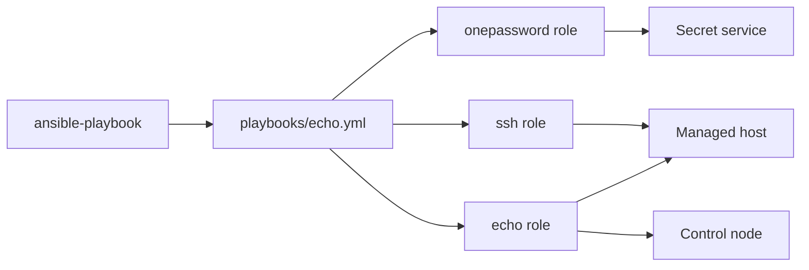
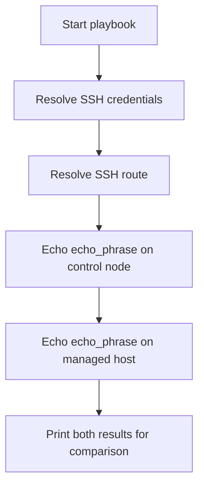

# Echo

## Scope

[`playbooks/echo.yml`](../../playbooks/echo.yml) invokes
[`roles/echo`](../../roles/echo) to print one configured phrase first on the
control node and then on each managed host. It validates downstream variable
propagation; it does not configure the host.

### Supported Hosts

Any host that Ansible can reach and that provides `echo` is supported. The role
does not gather platform facts or branch on operating system or architecture.

## Goal

Use this playbook to prove that a value from role defaults, downstream
`group_vars/` or `host_vars/`, or a runtime override resolves identically on
the controller and managed host.

## Invocation

```bash
ansible-playbook playbooks/echo.yml -i '<target>,' \
  -e onePasswordVault='<vault>'
```

## Architecture



## Workflow



## Variables

Put a shared phrase in downstream `group_vars/`, a host-specific phrase in
`host_vars/`, or use `-e` for a one-run check. Credentials remain in the
runtime secret resolver.

| Variable | Type | Source | Default / required | Purpose |
| --- | --- | --- | --- | --- |
| `echo_phrase` | `string` | Role default, `group_vars`, `host_vars`, or runtime `-e` | `why hello there` | Value printed in both execution contexts. |
| `onePasswordVault` | `string` | Role default, inventory, or runtime `-e` | Configured default is redacted | Coordinate for shared SSH credential resolution. |

## Usage

```bash
ansible-playbook playbooks/echo.yml -i '<target>,' \
  -e onePasswordVault='<vault>' \
  -e echo_phrase='<test-phrase>'
```

A successful run prints the same phrase from the control-node and managed-host
tasks.

## Verification

- `make test` syntax-checks [the playbook](../../playbooks/echo.yml).
- There is no Echo-specific unit test, Molecule scenario, or e2e HIL procedure
  under [`hil-test/`](../../hil-test). Behavioral automation remains a documented
  verification gap.
