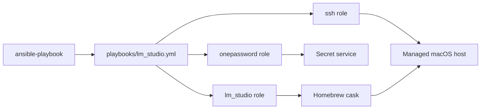
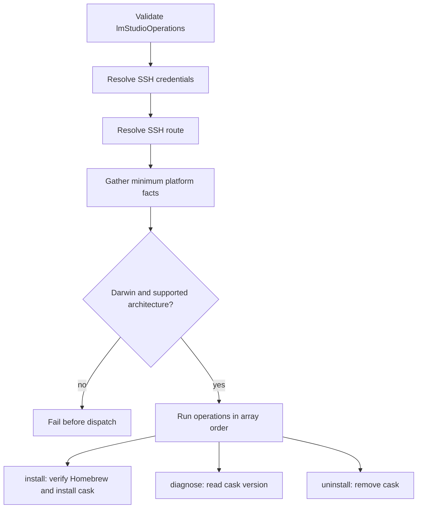

# LM Studio

## Scope

[`playbooks/lm_studio.yml`](../../playbooks/lm_studio.yml) and
[`roles/lm_studio`](../../roles/lm_studio) manage the LM Studio Homebrew cask
through the ordered, non-empty `lmStudioOperations` array.

| Operation | Result |
| --- | --- |
| `install` | Install the `lm-studio` cask. |
| `diagnose` | Print the installed cask version. |
| `uninstall` | Remove the cask. |

Server enablement, LAN binding, and macOS application-firewall configuration are
outside this domain.

### Supported Hosts

| OS family | Architectures |
| --- | --- |
| `Darwin` | `x86_64`, `arm64` |

The values match Ansible facts exactly. Other combinations fail before dispatch.

## Goal

Use this domain to install, inspect, or remove the LM Studio desktop application
on a supported macOS workstation.

## Invocation

```bash
ansible-playbook playbooks/lm_studio.yml -i '<target>,' \
  -e onePasswordVault='<vault>' \
  -e '{"lmStudioOperations":["install"]}'
```

## Architecture



## Workflow



## Variables

Put shared configuration in downstream `group_vars/`, host-specific
configuration in `host_vars/`, and invocation-only operations in runtime
`-e`.

| Variable | Type | Source | Default / required | Purpose |
| --- | --- | --- | --- | --- |
| `lmStudioOperations` | `array[enum]`: `diagnose`, `install`, `uninstall` | Runtime `-e` | Required; role default is `[]` | Ordered operations to execute. |
| `lmStudioPort` | `string` | Role default, inventory, or runtime `-e` | `1234` | Documents the application server port; the role does not open or bind it. |
| `onePasswordVault` | `string` | Role default, inventory, or runtime `-e` | Configured default is redacted | Coordinate for shared SSH credential resolution. |

See the [variable schema](../../.schema/ansible-vars.schema.json).

## Usage

```bash
ansible-playbook playbooks/lm_studio.yml -i '<target>,' \
  -e onePasswordVault='<vault>' \
  -e '{"lmStudioOperations":["install"]}'

ansible-playbook playbooks/lm_studio.yml -i '<target>,' \
  -e onePasswordVault='<vault>' \
  -e '{"lmStudioOperations":["diagnose"]}'

ansible-playbook playbooks/lm_studio.yml -i '<target>,' \
  -e onePasswordVault='<vault>' \
  -e '{"lmStudioOperations":["uninstall"]}'
```

Multiple values, such as `["install","diagnose"]`, run in order.

## Verification

- [Installer contract tests](../../tests/test_application_installers.py) verify
  operation dispatch, platform facts, schemas, and playbook layering.
- [LM Studio tests](../../tests/test_lm_studio.py) verify post-routing fact
  gathering.
- No macOS-capable Molecule scenario or LM Studio e2e HIL procedure exists
  under [`hil-test/`](../../hil-test); live install, diagnose, and uninstall coverage is
  an explicit verification gap.
