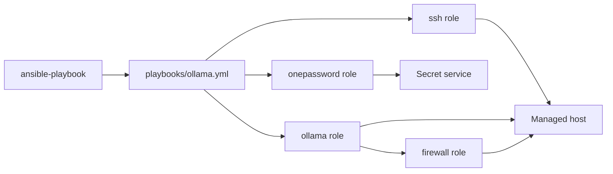
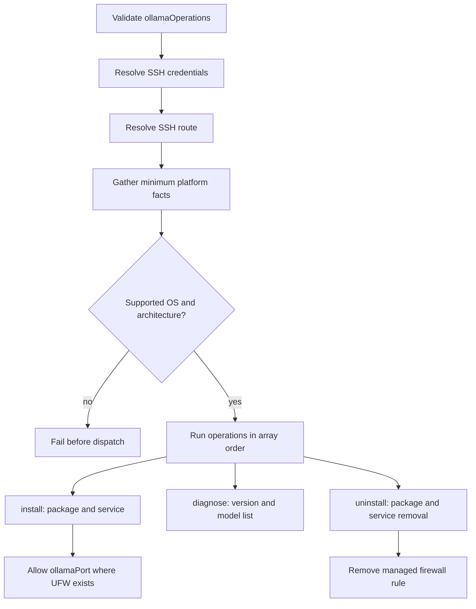

# Ollama

## Scope

[`playbooks/ollama.yml`](../../playbooks/ollama.yml) and
[`roles/ollama`](../../roles/ollama) manage the Ollama server through the
ordered, non-empty `ollamaOperations` array.

| Operation | Result |
| --- | --- |
| `install` | Install Ollama, start its service, and open its configured API port where UFW is present. |
| `diagnose` | Print the Ollama version and locally available models. |
| `uninstall` | Remove Ollama and its managed firewall rule. |

Binding Ollama beyond localhost is outside this domain.

### Supported Hosts

| OS family | Architectures |
| --- | --- |
| `Darwin` | `x86_64`, `arm64` |
| `Debian` | `x86_64`, `aarch64` |

The values match Ansible facts exactly. Unsupported combinations fail before
dispatch. Darwin uses Homebrew; Debian uses Ollama's native Linux installer.

## Goal

Use this domain to install, inspect, or remove a locally hosted Ollama runtime
and keep its managed firewall rule synchronized with the installation.

## Invocation

```bash
ansible-playbook playbooks/ollama.yml -i '<target>,' -b \
  -e onePasswordVault='<vault>' \
  -e '{"ollamaOperations":["install"]}'
```

## Architecture



## Workflow



## Variables

Put environment-wide values in downstream `group_vars/`, host-specific values
in `host_vars/`, and operation arrays in runtime `-e`.

| Variable | Type | Source | Default / required | Purpose |
| --- | --- | --- | --- | --- |
| `ollamaOperations` | `array[enum]`: `diagnose`, `install`, `uninstall` | Runtime `-e` | Required; role default is `[]` | Ordered operations to execute. |
| `ollamaPort` | `string` | Role default, inventory, or runtime `-e` | `11434` | API port managed in the Linux firewall. |
| `onePasswordVault` | `string` | Role default, inventory, or runtime `-e` | Configured default is redacted | Coordinate for shared SSH credential resolution. |

See the [variable schema](../../.schema/ansible-vars.schema.json).

## Usage

```bash
ansible-playbook playbooks/ollama.yml -i '<target>,' -b \
  -e onePasswordVault='<vault>' \
  -e '{"ollamaOperations":["install"]}'

ansible-playbook playbooks/ollama.yml -i '<target>,' -b \
  -e onePasswordVault='<vault>' \
  -e '{"ollamaOperations":["diagnose"]}'

ansible-playbook playbooks/ollama.yml -i '<target>,' -b \
  -e onePasswordVault='<vault>' \
  -e '{"ollamaOperations":["uninstall"]}'
```

Multiple values, such as `["install","diagnose"]`, run in order. Opening the
firewall does not change Ollama's default loopback binding; configure external
binding separately if required.

## Verification

- [Installer contract tests](../../tests/test_application_installers.py) verify
  operation dispatch, platform facts, schemas, and layering.
- [Molecule scenario](../../roles/ollama/molecule/default) covers Debian
  installation, service state, CLI response, and the UFW rule:
  `make test-molecule-ollama`.
- No Ollama e2e HIL procedure exists under [`hil-test/`](../../hil-test); Darwin and
  live uninstall/diagnose workflows remain an explicit verification gap.
