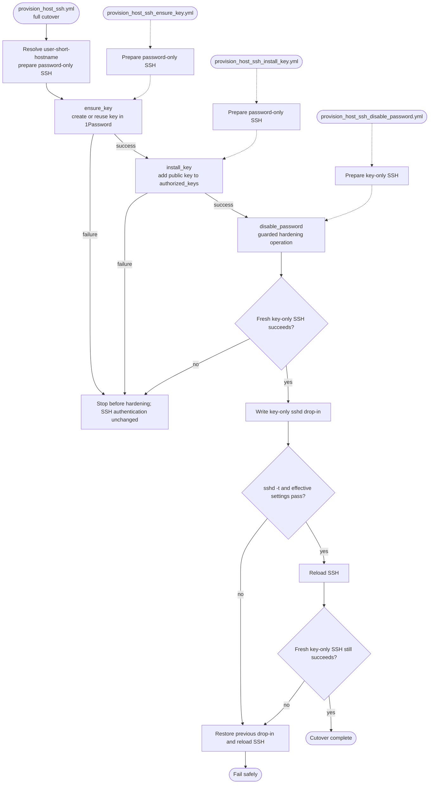

# Host SSH provisioning

The [`provision_host` role](../../roles/provision_host) creates or
reuses a per-host SSH key in 1Password, installs its public key, proves a fresh
key-only session, and only then disables SSH password authentication. It follows
the repository's [playbook layering](../../.claude/specs/architecture/playbook-layering.md).

The private key is generated directly in 1Password. During independent validation it is
written to a mode-0600 file in an ephemeral controller directory and removed in
an Ansible `always` block. It is never copied to the managed host.

The matching Login item must be named `user-<short-hostname>` and contain the
host username and password. The SSH Key item is named
`sshkey-<short-hostname>`. DNS, `.local`, and Tailnet suffixes are excluded from
both item names.

## Operations

| Playbook | Role operation | Kind | Purpose |
| --- | --- | --- | --- |
| `playbooks/provision_host_ssh.yml` | `provision` | Full cutover | Run the complete ordered workflow. |
| `playbooks/provision_host_ssh_ensure_key.yml` | `ensure_key` | Mutating step | Create or reuse `sshkey-<hostname>` in 1Password and maintain its SSH bookmark. |
| `playbooks/provision_host_ssh_install_key.yml` | `install_key` | Mutating step | Read the public key from 1Password and add it to the login user's `authorized_keys`. |
| `playbooks/provision_host_ssh_disable_password.yml` | `disable_password` | Guarded hardening | Revalidate the key, harden `sshd`, reload it, and validate again. |

The individual playbooks are intended for an external control flow. The
`disable_password` operation deliberately includes its own validation and
cannot rely on a success flag from an earlier workflow job.

### Workflow



### Shared SSH validation

Provisioning delegates its pre-hardening and post-reload gates to the reusable
[`ssh`](ssh.md) capability. Standalone diagnostics and future key-rolling
workflows use that same validator; validation is not a provisioning operation.

Ansible `--check` remains a provisioning dry run. The shared validator performs
its real controller-side probe even in check mode because authentication cannot
be simulated.

## Safety and failure behavior

The full operation runs one host at a time. The validation command explicitly
disables passwords, keyboard-interactive authentication, SSH agents, and
connection sharing, so an existing password-authenticated control socket cannot
produce a false positive.

Before reloading SSH, the role validates the complete daemon configuration and
checks its effective settings. After reload it opens another fresh key-only
session. If any hardening or post-reload validation task fails, the role restores
the previous `00-zero-bringup.conf`, validates it, reloads SSH, and reports the
failure.

The role disables password and keyboard-interactive SSH globally. It does not
lock the Unix account password or alter sudo policy. The shared SSH role reads
the Login item password into `ansible_become_password`, so a separate
`--ask-become-pass` prompt is not required.

## Supported hosts

The role supports Debian-family hosts, including Ubuntu, on `x86_64`, `aarch64`,
and `armv7l`. It expects the bootstrap to have installed `openssh-server` and to
have made `/usr/sbin/sshd` and the `ssh` service available. Declared
`hostOperatingSystem` and `hostArchitecture` values are checked against gathered
facts. Unsupported or mismatched hosts fail the selected operation without
changing SSH authentication.

## Variables

All inputs have role defaults and may be overridden in the downstream
inventory. See the
[variable schema](../../.schema/ansible-vars.schema.json) for full descriptions.

| Variable | Default / source | Purpose |
| --- | --- | --- |
| `onePasswordVault` | `Personal-Automation` | Vault where the SSH Key item is stored. |
| `provisionHostSshUser` | Prepared `ansible_user`, then `hostUserName` | Non-root remote login account read from `user-<short-hostname>`. |
| `provisionHostSshHost` | `ansible_host`, then `inventory_hostname` | Address used for independent validation. |
| `provisionHostSshPort` | `ansible_port`, then `22` | SSH validation port and bookmark port. |
| `provisionHostSshItemName` | `sshkey-<hostname>` | Exact 1Password SSH Key item title. |
| `provisionHostSshKeyType` | `ed25519` | New-key algorithm; RSA sizes are also accepted. |
| `provisionHostSshOpTokenFile` | `~/.config/op/op-service-account-token` | Controller service-account token file. |
| `provisionHostSshSshdDropIn` | `/etc/ssh/sshd_config.d/00-zero-bringup.conf` | Bootstrap drop-in replaced during hardening. |
| `provisionHostSshStrictHostKeyChecking` | `accept-new` | Pin the first host key for the current run; ephemeral trust resets on the next run. |
| `provisionHostSshValidationTimeout` | `10` | Validation connection timeout in seconds. |
| `provisionHostSshValidationExtraArgs` | `[]` | Extra `ssh` argv entries, such as a ProxyJump. |
| `provisionHostSshAddBookmark` | `true` | Maintain an `ssh://` URL field for 1Password SSH bookmarks. |

The service account must have read and write access to `onePasswordVault`.
Store its token in the configured controller file with owner-only permissions.

## Usage

The complete playbook and the three provisioning-stage playbooks are alternative
happy paths. Use the complete playbook for a single-command cutover, or run the
stages when an external workflow needs a checkpoint. The independent SSH
validation command is documented under the shared [SSH capability](ssh.md).
Before password authentication is disabled, the provisioning entry points read
the temporary login password from `user-<short-hostname>`. The only required
CLI inputs are the host endpoint and 1Password vault.

### 1. Run the complete cutover

This performs `ensure_key`, `install_key`, key validation, and guarded SSH
hardening in one run:

```bash
ansible-playbook playbooks/provision_host_ssh.yml \
  -i 'host.example.net,' \
  -e onePasswordVault=Personal-Automation
```

### 2. Ensure the key exists in 1Password

This creates or reuses `sshkey-<hostname>` and maintains its SSH bookmark. It
does not modify the target host, but Ansible still connects to gather and
validate host facts:

```bash
ansible-playbook playbooks/provision_host_ssh_ensure_key.yml \
  -i 'host.example.net,' \
  -e onePasswordVault=Personal-Automation
```

### 3. Install the public key

This reads the existing public key from 1Password and adds it to the login
user's `authorized_keys`. Sudo is required to manage the selected user's key:

```bash
ansible-playbook playbooks/provision_host_ssh_install_key.yml \
  -i 'host.example.net,' \
  -e onePasswordVault=Personal-Automation
```

### 4. Disable password SSH

This repeats key-only validation, updates and reloads `sshd`, and validates the
key again after reload. It rolls the SSH drop-in back if hardening or the final
connection test fails:

```bash
ansible-playbook playbooks/provision_host_ssh_disable_password.yml \
  -i 'host.example.net,' \
  -e onePasswordVault=Personal-Automation
```

After step 4, future repository playbooks retrieve the provisioned key on demand
from 1Password; the temporary SSH password will no longer be accepted by sshd.

## On-demand use from 1Password

Every repository playbook now handles on-demand retrieval itself. Ansible Core
2.19 or newer receives the OpenSSH private-key content through
`ansible_private_key` and places it in the Ansible-managed ephemeral SSH agent
enabled in `ansible.cfg`. The role also supplies the matching public identity,
so unrelated agent keys cannot be selected. It neither reads nor includes
`~/.ssh/config`, and it does not require the 1Password desktop SSH Agent.

## Verification

Static contract tests in `tests/test_provision_host_ssh.py` verify operation
layering, shared-validator reuse, rollback behavior, and schema coverage. The
shared validator has its own contracts in `tests/test_validate_host_ssh_key.py`.
No Molecule scenario performs the live path because it requires an external
writable 1Password vault and a second real SSH connection. Before production,
run `make test`, then use a disposable Ubuntu host to exercise the full playbook
and confirm both key access and rejection of password authentication.
