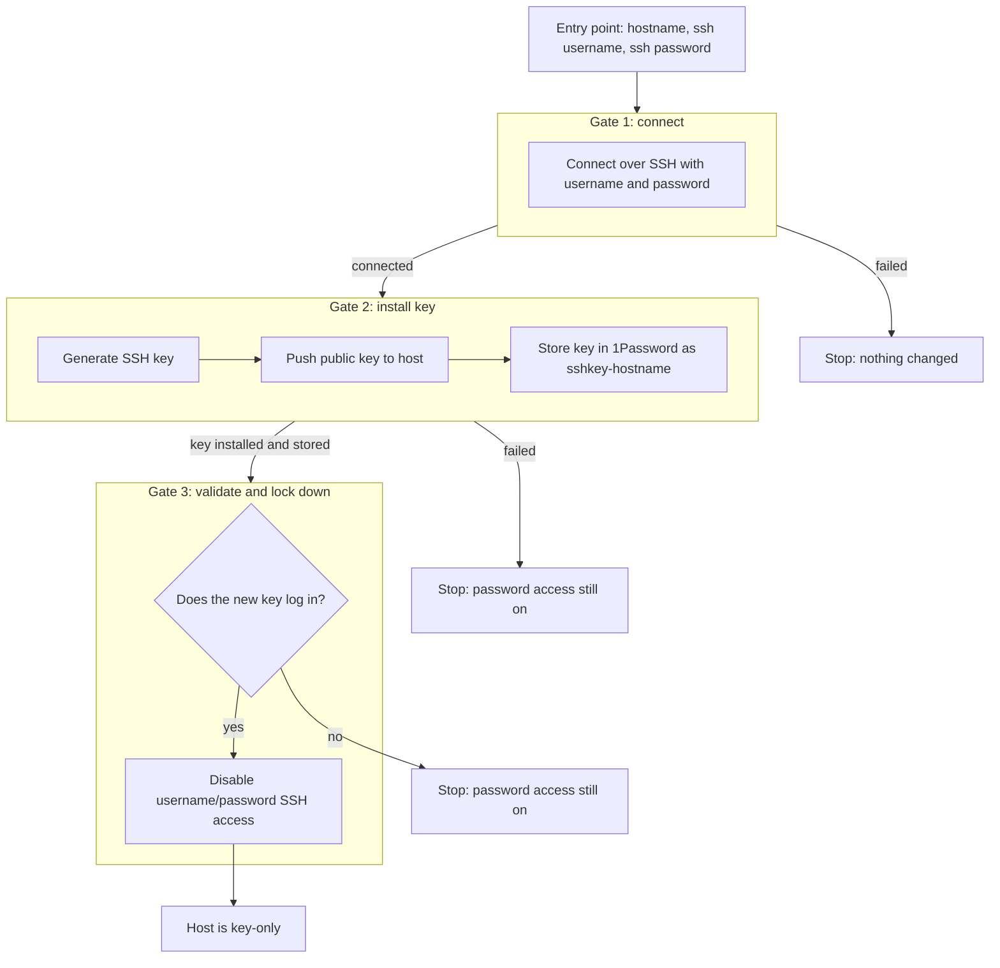

# Host provisioning

## Goal

Bring a new host from password-only SSH access to key-only SSH access, with the generated key stored in 1Password. The workflow is built one gate at a time; this page records the target design, not what is implemented.

## Workflow

## Gates

| Gate | Purpose | Passes when |
| --- | --- | --- |
| 1. Connect | Reach the host with the supplied username and password | The SSH login succeeds |
| 2. Install key | Generate a key, push it to the host, store it in 1Password as `sshkey-hostname` | The key is on the host and in 1Password |
| 3. Validate and lock down | Prove the new key works, then turn off password access | Key login succeeds, then password login is disabled |

Password access is only disabled after the key is proven to work, so a failure at any gate leaves the host reachable.
