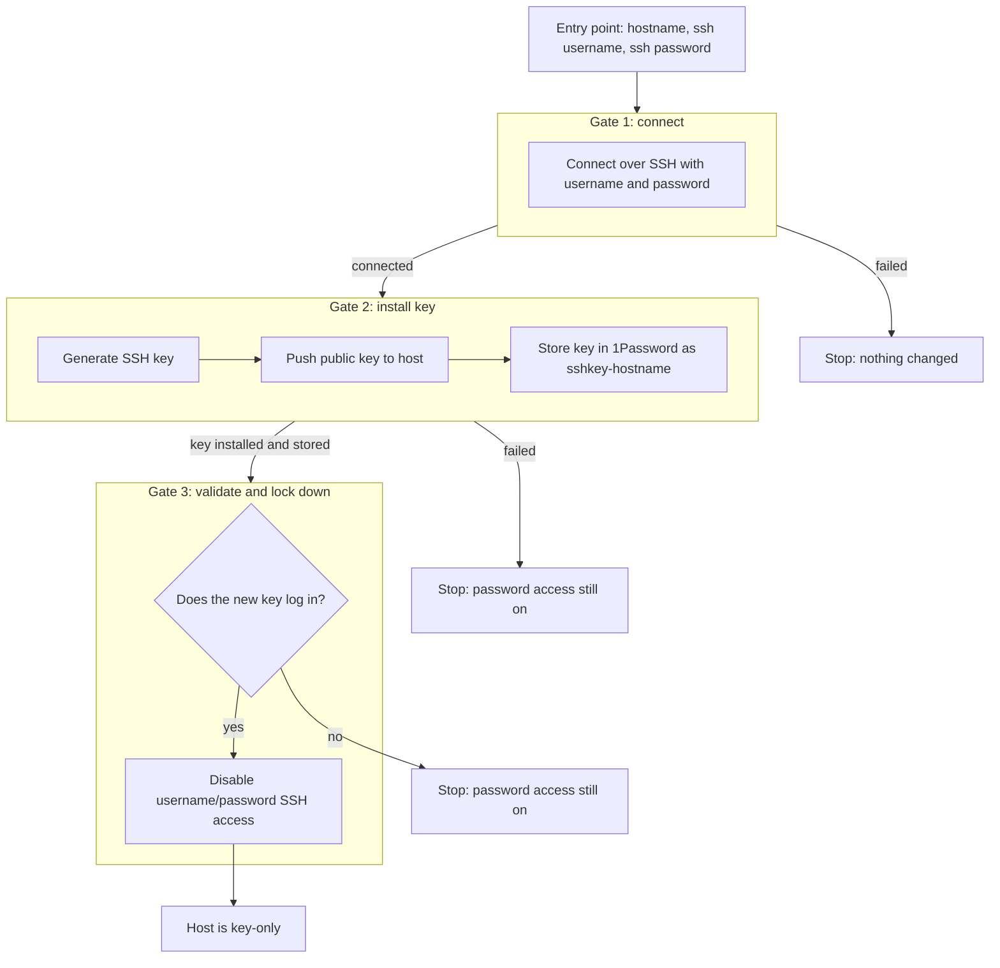

# Host provisioning

## Goal

Bring a new host from password-only SSH access to key-only SSH access, with the generated key stored in 1Password. The workflow is built one gate at a time; this page records the target design, not what is implemented.

## Workflow



## Gates

| Gate | Purpose | Passes when |
| --- | --- | --- |
| 1. Connect | Reach the host with the supplied username and password | The SSH login succeeds |
| 2. Install key | Generate a key, push it to the host, store it in 1Password as `sshkey-hostname` | The key is on the host and in 1Password |
| 3. Validate and lock down | Prove the new key works, then turn off password access | Key login succeeds, then password login is disabled |

Password access is only disabled after the key is proven to work, so a failure at any gate leaves the host reachable.

## Playbooks

Provisioning reuses the shared SSH router (routing and isolation) described in
[`ssh.md`](ssh.md), but takes its SSH credentials from the command line
(`-e provisioning_username=... -e provisioning_password=...`), **not** from
1Password — a host being provisioned has no 1Password Login item or key yet. Both
playbooks run with `gather_facts: false`.

| Playbook | Gate | Implemented today |
| --- | --- | --- |
| `playbooks/provision-installSSHKey.yml` | 1–2 (connect + install key) | Routes to the host, binds the run-time username/password, generates an `ed25519` keypair in a temp dir, pushes the public key to the host's `authorized_keys` (`ansible.posix.authorized_key`), then moves the keypair into the control node's `~/.ssh/` as `{{ sshFileName }}` (default `common-ssh-key`). **1Password storage (gate 2's final step) is still pending.** |
| `playbooks/provision-validate-and-secureSSH.yml` | 3 (validate and lock down) | **Stub** — the play declares no tasks. |

## Usage

Target the host with an explicit inline inventory, `-i '<host-or-ip>,'` (an IP or
qualified hostname; bare single-label names are rejected by the router). The
provisioning credentials are passed with `no_log` and never written to inventory
or disk.

**Gates 1–2 — connect and install the key.** Reach a freshly imaged host with the
username and password it was built with, then generate and install a key:

```bash
ansible-playbook playbooks/provision-installSSHKey.yml -i '<host-or-ip>,' \
  -e provisioning_username=<user> -e provisioning_password=<password> \
  [-e sshFileName=<name>]
```

`sshFileName` (default `common-ssh-key`) sets the keypair basename. The run
generates `<sshFileName>` / `<sshFileName>.pub` in a temporary directory, adds the
public key to the host user's `authorized_keys`, and on success moves the keypair
into the control node's `~/.ssh/` (`0600` private, `0644` public), overwriting any
existing files of those names. Storing the key in 1Password is still pending.

**Gate 3 — validate and lock down.** No happy path yet;
`provision-validate-and-secureSSH.yml` is a stub and runs no tasks. This section
will document its invocation once the gate is implemented.
