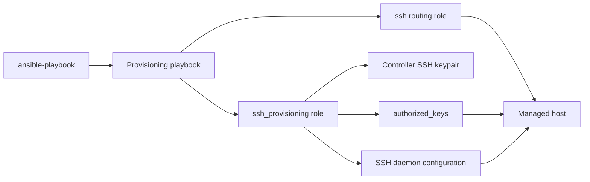
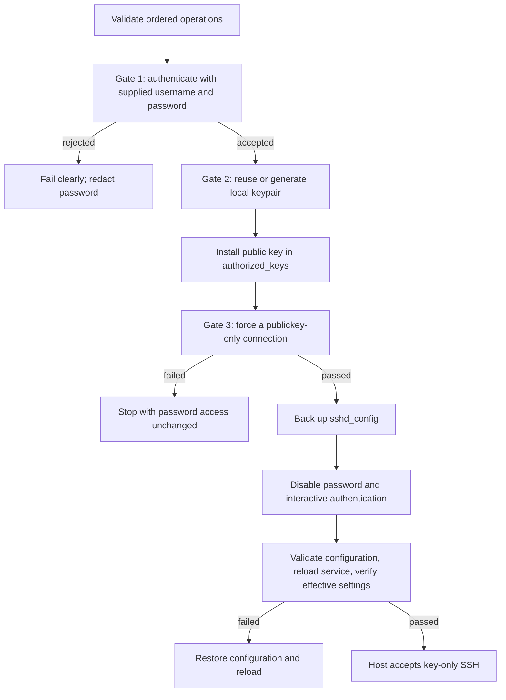

# Host provisioning

## Scope

The SSH provisioning domain moves a host from password-authenticated SSH to a
validated local key and then disables password authentication. Three playbooks
compose the ordered `sshProvisioningOperations` interface:

| Playbook | Operations | Result |
| --- | --- | --- |
| [`provision-installSSHKey.yml`](../../playbooks/provision-installSSHKey.yml) | `connect`, `install_key` | Validate bootstrap credentials and install or reuse a local public key. |
| [`provision-validate-and-secureSSH.yml`](../../playbooks/provision-validate-and-secureSSH.yml) | `validate`, `disable_password` | Prove key-only login, then secure the SSH daemon. |
| [`provision-full.yml`](../../playbooks/provision-full.yml) | all four operations | Run the complete handoff in one play. |

The role does not store the generated key in a secret service.

### Supported Hosts

The connection and key gates use platform-independent Ansible modules. The
lock-down gate supports hosts with `/etc/ssh/sshd_config`,
`/usr/sbin/sshd`, and either an `ssh` or `sshd` service. Role metadata
declares macOS, Ubuntu, and EL families, but the complete lock-down path depends
on that Unix-style daemon layout and service discovery.

## Goal

Use this domain to perform a fail-closed SSH key handoff: password access is not
disabled until the newly installed key succeeds in a publickey-only connection.

## Invocation

```bash
ansible-playbook playbooks/provision-full.yml -i '<target>,' \
  -e sshProvisioningUsername='<username>' \
  -e sshProvisioningPassword='<password>' \
  -e sshFileName='<ssh-key-name>'
```

## Architecture



## Workflow



## Variables

Provisioning credentials and operation lists are invocation-only and SHALL be
passed with `-e`; do not store them in `host_vars/` or `group_vars/`.
Non-secret key policy may be set in downstream inventory when consistently
applied. Password values are protected by `no_log`.

| Variable | Type | Source | Default / required | Purpose |
| --- | --- | --- | --- | --- |
| `sshProvisioningOperations` | `array[enum]`: `connect`, `install_key`, `validate`, `disable_password` | Playbook role argument | Required; role default is `[]` | Ordered safety gates. |
| `sshProvisioningUsername` | `string` | Runtime `-e` | Required by connection and validation gates | Target account being provisioned. |
| `sshProvisioningPassword` | sensitive `string` | Runtime `-e` | Required for bootstrap; optional only with passwordless privilege escalation in the secure-only playbook | Bootstrap SSH and privilege-escalation password. |
| `sshFileName` | `string` | Role default or runtime `-e` | Configured default is redacted | Basename of the controller-side keypair. |
| `sshKeyOverwrite` | `bool` | Role default, inventory, or runtime `-e` | `false` | Replace an existing controller keypair when true. |

See the [variable schema](../../.schema/ansible-vars.schema.json).

## Usage

Install or reuse a key while password authentication is available:

```bash
ansible-playbook playbooks/provision-installSSHKey.yml -i '<target>,' \
  -e sshProvisioningUsername='<username>' \
  -e sshProvisioningPassword='<password>' \
  -e sshFileName='<ssh-key-name>'
```

Validate that key and disable password authentication:

```bash
ansible-playbook playbooks/provision-validate-and-secureSSH.yml -i '<target>,' \
  -e sshProvisioningUsername='<username>' \
  -e sshProvisioningPassword='<password>' \
  -e sshFileName='<ssh-key-name>'
```

For this second playbook the password is used for privilege escalation, not SSH
authentication. Run the full sequence with the Invocation command. Set
`-e sshKeyOverwrite=true` only when intentionally replacing the existing local
keypair.

Authentication rejection names the requested user and host while redacting the
password and raw result. Routing, network, and SSH-service failures receive a
separate diagnostic.

## Verification

- [Provisioning contract tests](../../tests/test_provision_host_ssh.py) verify
  playbook composition, local-key handling, explicit authentication errors,
  validation flags, rollback, and schema coverage.
- [Provisioning safety tests](../../tests/test_ssh_provisioning.py) verify
  ordered dispatch and the key-only gate before password lock-down.
- No Molecule scenario covers the full live SSH handoff.
- [The e2e HIL procedure](../../hil-test/provisioning-ssh/readme.md) resets a
  real target to password-authenticated SSH and runs `provision-full.yml`.
  Success requires all four gates to pass and the target to finish with
  key-only SSH.
