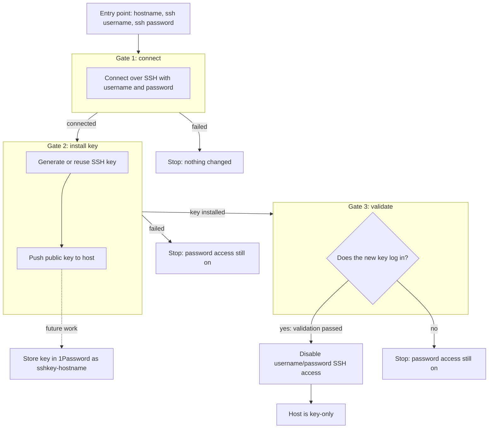

# Host provisioning

## Goal

Bring a new host from password-only SSH access to key-only SSH access. The
workflow is built one gate at a time and refuses to disable password access
until the installed key has authenticated over a publickey-only connection.
Storing the generated key in 1Password remains future work.

## Workflow



## Gates

| Gate | Purpose | Passes when |
| --- | --- | --- |
| 1. Connect | Reach the host with the supplied username and password | The SSH login succeeds |
| 2. Install key | Generate or reuse a key and push it to the host | The key is on the host; 1Password storage remains pending |
| 3. Validate and lock down | Prove the new key works, then turn off password access | A publickey-only login succeeds before password login is disabled |

Password access is only disabled after the key is proven to work, so a failure at any gate leaves the host reachable.

## Playbooks

Provisioning reuses the shared SSH router (routing and isolation) described in
[`ssh.md`](ssh.md), but takes its SSH credentials from the command line
(`-e sshProvisioningUsername=... -e sshProvisioningPassword=...`), **not** from
1Password — a host being provisioned has no 1Password Login item or key yet. Both
playbooks run with `gather_facts: false`.

The `ssh_provisioning` role accepts an ordered `sshProvisioningOperations`
list and dispatches each entry to `tasks/<operation>.yml`. The install playbook
requests `[connect, install_key]`; the validate-and-secure playbook requests
`[validate, disable_password]`. Successful gate facts enforce those dependencies
inside the role, so `install_key` or `disable_password` cannot run without its
required predecessor. Additional independent operations can be listed and are
executed in declaration order.

| Playbook | Gate | Implemented today |
| --- | --- | --- |
| `playbooks/provision-installSSHKey.yml` | 1–2 (connect + install key) | Routes to the host, binds the run-time username/password, reuses an existing local key by default or generates an `ed25519` keypair, and pushes the public key to the host's `authorized_keys` (`ansible.posix.authorized_key`). **1Password storage (gate 2's final step) is still pending.** |
| `playbooks/provision-validate-and-secureSSH.yml` | 3 (validate and lock down) | Runs `disable_password`, which first connects as `sshProvisioningUsername` using `~/.ssh/{{ sshFileName }}` with password fallback disabled. Only after that validation succeeds does it install and verify the SSH daemon lock-down configuration. |

## Usage

Target the host with an explicit inline inventory, `-i '<host-or-ip>,'` (an IP or
qualified hostname; bare single-label names are rejected by the router). The
provisioning credentials are passed with `no_log` and never written to inventory
or disk.

**Gates 1–2 — connect and install the key.** Reach a freshly imaged host with the
username and password it was built with, then generate and install a key:

```bash
ansible-playbook \
    playbooks/provision-installSSHKey.yml \
    -i '<host-or-ip>,' \
    -e sshProvisioningUsername=<user> \
    -e sshProvisioningPassword=<password> \
    [-e sshFileName=<name>]
```

`sshFileName` (default `common-ssh-key`) sets the keypair basename. When that
private key already exists in the control node's `~/.ssh/`, it is reused. If it
does not exist, the run generates `<sshFileName>` / `<sshFileName>.pub`, adds the
public key to the host user's `authorized_keys`, and moves the pair into
`~/.ssh/` (`0600` private, `0644` public). Set `-e sshKeyOverwrite=true` only
when the existing keypair should be replaced. Storing the key in 1Password is
still pending.

**Gate 3 — validate and lock down.** The playbook runs `validate` followed by
`disable_password`. The validation operation connects as
`sshProvisioningUsername` using `~/.ssh/{{ sshFileName }}` and forces a
publickey-only connection (`PreferredAuthentications=publickey`,
`PasswordAuthentication=no`, `BatchMode=yes`). A passing `ping` therefore means
the key itself authenticated—not a password fallback. Only then does the role
disable password and keyboard-interactive authentication, validate the complete
SSH daemon configuration, reload it, and verify the effective settings:

```bash
ansible-playbook \
    playbooks/provision-validate-and-secureSSH.yml \
    -i '<host-or-ip>,' \
    -e sshProvisioningUsername=<user> \
    -e sshProvisioningPassword=<password> \
    [-e sshFileName=<name>]
```

Use the same `sshFileName` you installed with (default `common-ssh-key`). No
SSH password is used for authentication: the installed private key is the only
permitted SSH authentication method. For this playbook,
`sshProvisioningPassword` is assigned to `ansible_become_password` and used only
for `sudo` while securing the SSH daemon. It is required when the remote account
uses password-protected `sudo`; omit it only when the account is root or has
passwordless `sudo`.

Supply `sshProvisioningPassword` again even if it was passed to the install-key
playbook. Extra variables do not persist between separate `ansible-playbook`
commands. This provisioning workflow does not query 1Password, so setting
`onePasswordVault` does not provide the privilege-escalation password.

The lock-down block is placed first in `/etc/ssh/sshd_config` because OpenSSH
uses the first value it encounters for these settings. If configuration
validation or reload fails, the previous SSH daemon configuration is restored
and reloaded.

**Full Playbook**

```bash
ansible-playbook \
    playbooks/provision-full.yml \
    -e onePasswordVault=Personal-Automation \
    -i '<host-or-ip>,' \
    -e sshProvisioningUsername=<user> \
    -e sshProvisioningPassword=<password> \
    [-e sshFileName=<name>]
```
