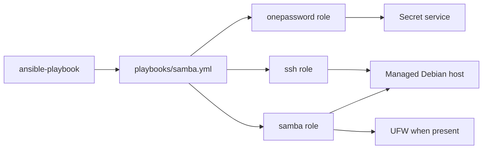
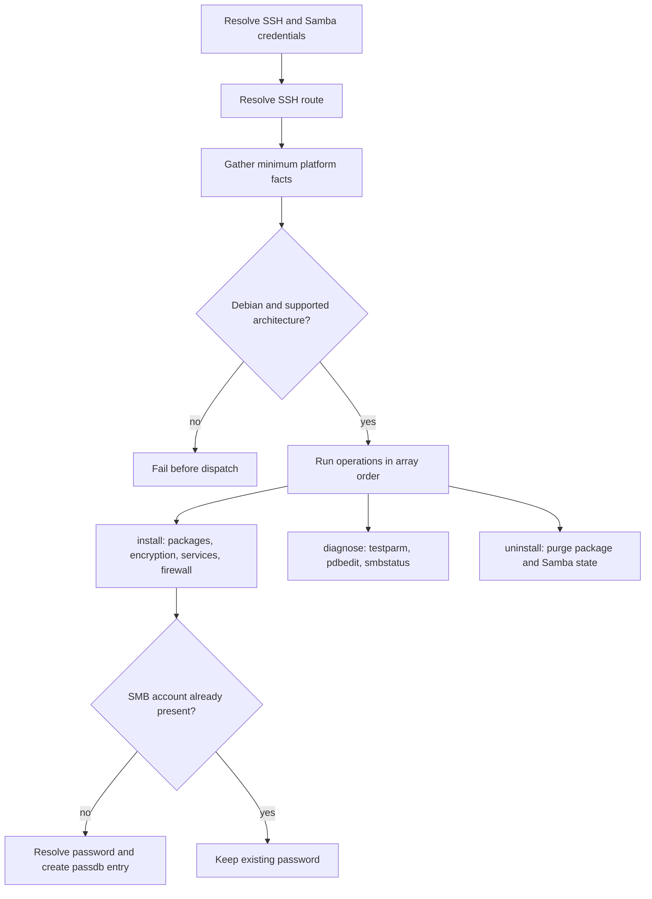

# Samba

## Scope

[`playbooks/samba.yml`](../../playbooks/samba.yml) and
[`roles/samba`](../../roles/samba) manage an encrypted Samba service and SMB
account through the ordered, non-empty `sambaOperations` array.

| Operation | Result |
| --- | --- |
| `install` | Install Samba, require SMB encryption, enable services, allow SMB through UFW when present, and provision one SMB user. |
| `diagnose` | Print validated configuration, passdb users, and server status. |
| `uninstall` | Purge Samba packages, configuration, caches, logs, and passdb state; Unix users and home directories remain. |

### Supported Hosts

| OS family | Architectures |
| --- | --- |
| `Debian` | `x86_64`, `aarch64`, `armv7l` |

The values match Ansible facts exactly. Unsupported combinations fail before
dispatch.

## Goal

Use this domain to establish or remove a Debian Samba service with encrypted SMB
transport and a runtime-resolved account credential, or to inspect its effective
state.

## Invocation

```bash
ansible-playbook playbooks/samba.yml -i '<target>,' -b \
  -e onePasswordVault='<vault>' \
  -e sambaPasswordOpItem='<secret-item>' \
  -e '{"sambaOperations":["install"]}'
```

## Architecture



## Workflow



## Variables

Put shared non-secret configuration in downstream `group_vars/` and
machine-specific account coordinates in `host_vars/`. Prefer the secret
resolver for passwords; a direct runtime password is sensitive and SHALL never
be committed to inventory or documentation.

| Variable | Type | Source | Default / required | Purpose |
| --- | --- | --- | --- | --- |
| `sambaOperations` | `array[enum]`: `diagnose`, `install`, `uninstall` | Runtime `-e` | Required; role default is `[]` | Ordered operations to execute. |
| `sambaUsername` | `string` | Secret resolver, `group_vars`, `host_vars`, or runtime `-e` | Empty; required for `install` directly or through the secret item | Unix/SMB account to provision. |
| `sambaPasswordOpItem` | `string` | `group_vars`, `host_vars`, or runtime `-e` | Empty; required by the public playbook | Non-secret secret-item coordinate resolved for every public-playbook invocation. |
| `sambaPassword` | sensitive `string` | Runtime `-e` only | Optional role-level override | Direct SMB password; never persisted. The public playbook still performs its configured Samba secret query first. |
| `onePasswordVault` | `string` | Role default, inventory, or runtime `-e` | Configured default is redacted | Vault coordinate used on the control node. |

See the [variable schema](../../.schema/ansible-vars.schema.json).

## Usage

Install with credentials resolved from the secret service:

```bash
ansible-playbook playbooks/samba.yml -i '<target>,' -b \
  -e onePasswordVault='<vault>' \
  -e sambaPasswordOpItem='<secret-item>' \
  -e '{"sambaOperations":["install"]}'
```

The role can accept `sambaPassword` directly, but the current public playbook
always runs the Samba 1Password query before the role. A direct password does
not bypass that prerequisite when invoking `playbooks/samba.yml`.

Diagnose or uninstall:

```bash
ansible-playbook playbooks/samba.yml -i '<target>,' -b \
  -e onePasswordVault='<vault>' \
  -e sambaPasswordOpItem='<secret-item>' \
  -e '{"sambaOperations":["diagnose"]}'

ansible-playbook playbooks/samba.yml -i '<target>,' -b \
  -e onePasswordVault='<vault>' \
  -e sambaPasswordOpItem='<secret-item>' \
  -e '{"sambaOperations":["uninstall"]}'
```

Multiple values, such as `["install","diagnose"]`, run in order. Installation
does not rotate an existing passdb user's password.

## Verification

- [Installer contract tests](../../tests/test_application_installers.py) verify
  operation dispatch, platform facts, schemas, and layering.
- [Samba contract tests](../../tests/test_samba.py) verify secret-resolution
  ownership.
- [Molecule scenario](../../roles/samba/molecule/default) covers the Debian
  install path with a direct test credential: `make test-molecule-samba`.
- No Samba e2e HIL procedure exists under [`hil-test/`](../../hil-test); live secret
  resolution, diagnose, and destructive uninstall remain an explicit gap.
