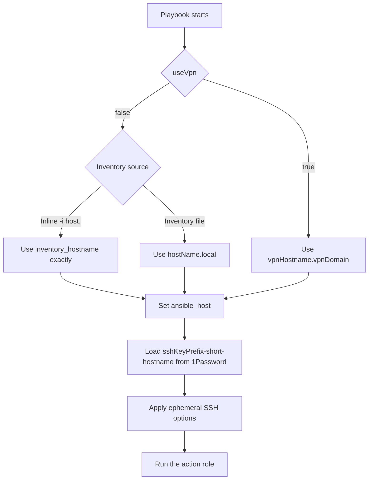

# SSH routing

Every remote playbook enters the `ssh` role before its action role. The router
selects one endpoint and applies it as `ansible_host`.

## Inline inventory

When `useVpn` is false, an inline host list is rigid. The router does not
append, remove, or replace any part of the supplied target.

| Invocation | SSH endpoint |
| --- | --- |
| `-i 'hostname,'` | `hostname` |
| `-i 'hostname.local,'` | `hostname.local` |
| `-i 'hostname.tail313959.ts.net,'` | `hostname.tail313959.ts.net` |

## Inventory file

Routing follows this precedence for every host:

- `useVpn: true` selects `vpnHostname.vpnDomain` first.
- Otherwise, an inline `-i` target is used exactly.
- Otherwise, a host loaded from an inventory file selects `hostName.local`.

The inventory owns `hostName`, `vpnHostname`, `vpnDomain`, and the
`useVpn` flag.

## SSH key

The router loads `<sshKeyPrefix>-<short-hostname>` from `onePasswordVault` with
`op read`. `sshKeyPrefix` defaults to `sshkey`. It requests OpenSSH format and
assigns the result directly to `ansible_private_key`. The key remains in memory
and is loaded by Ansible's managed SSH agent.

The service-account token is read from `onePasswordTokenFile`, which defaults
to `~/.config/op/op-service-account-token`. The lookup is protected by
`no_log`.

## SSH isolation

The router passes `-F /dev/null`, so it does not read `~/.ssh/config`. It uses
`/dev/null` for user and global known-host files, disables host-key persistence,
and disables SSH connection sharing and control sockets.

This framework does not resolve the SSH username or sudo password, validate
reachability, gather facts, or add workflow-specific safety behavior.
