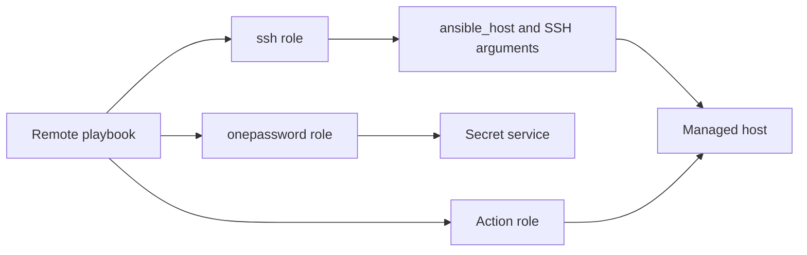
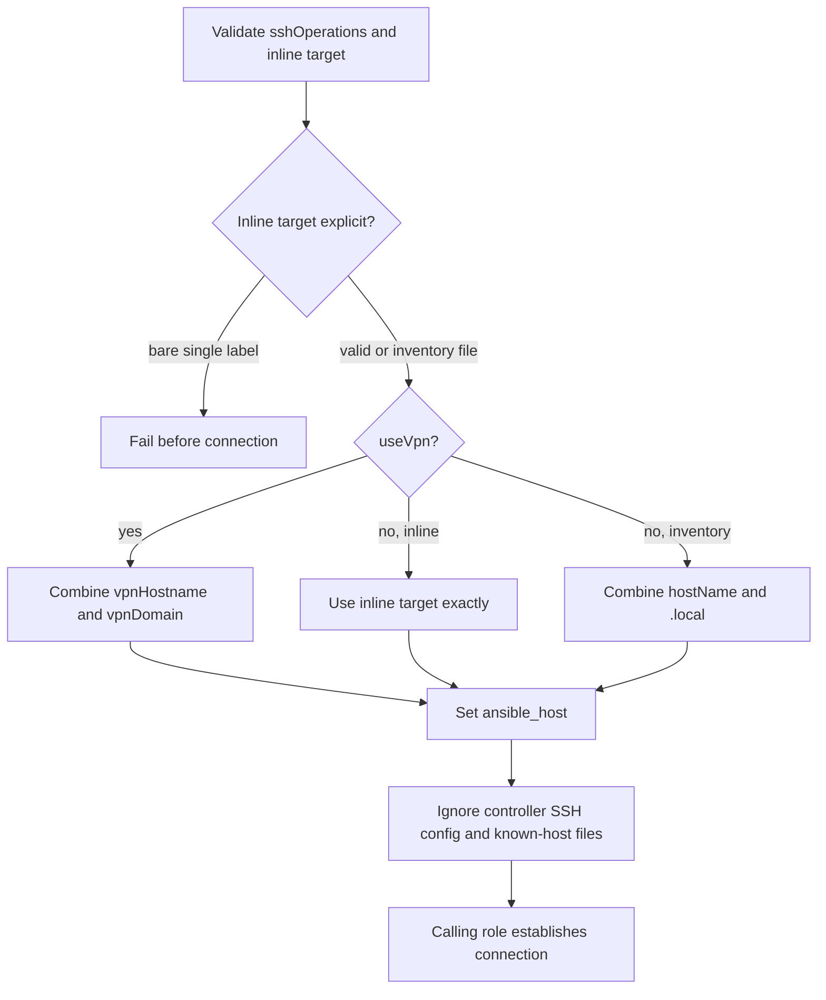

# SSH routing

## Scope

[`roles/ssh`](../../roles/ssh) validates explicit inline targets and resolves
the address used by remote playbooks. Its ordered `sshOperations` array
currently supports one operation:

| Operation | Result |
| --- | --- |
| `resolve` | Select the VPN, exact inline, or inventory-derived local route and set ephemeral SSH options. |

Credential lookup belongs to [`roles/onepassword`](../../roles/onepassword);
reachability checks, fact gathering, and workflow safety gates belong to the
calling domain.

### Supported Hosts

The router is platform-independent and gathers no managed-host facts. It can
route to any target supported by Ansible's SSH connection plugin. An ambiguous
single-label inline target fails before a remote connection is attempted.

## Goal

Include this role when a remote playbook needs one deterministic SSH endpoint
without relying on the controller's SSH configuration or persistent known-host
files.

## Invocation

In a playbook:

```yaml
roles:
  - role: ssh
```

## Architecture



## Workflow



## Variables

Put environment-wide route suffixes and prefixes in downstream `group_vars/`;
put `hostName`, `vpnHostname`, and per-host route choices in `host_vars/`.
Use runtime `-e` only for one-run overrides. Secret values are resolved by the
onepassword role and do not belong in inventory.

| Variable | Type | Source | Default / required | Purpose |
| --- | --- | --- | --- | --- |
| `sshOperations` | `array[enum]`: `resolve` | Role default or playbook role argument | `["resolve"]` | Ordered router operations. |
| `hostName` | `string` | `host_vars` or `group_vars` | Required for inventory-file local routing | Base hostname used to build `<host>.local`. |
| `useVpn` | `bool` | Role default, `group_vars`, `host_vars`, or runtime `-e` | `false` | Select the VPN route. |
| `vpnHostname` | `string` | `host_vars` | Required when `useVpn=true` | Host portion of the VPN address. |
| `vpnDomain` | `string` | Role default or downstream inventory | Configured default is redacted | VPN suffix combined with `vpnHostname`. |
| `sshLoginPrefix` | `string` | Shared role default or downstream inventory | `user` | Prefix used to locate the per-host Login item. |
| `sshKeyPrefix` | `string` | Shared role default or downstream inventory | `sshkey` | Prefix used to locate the per-host SSH key item. |
| `onePasswordVault` | `string` | Shared role default, inventory, or runtime `-e` | Configured default is redacted | Vault coordinate for SSH credential resolution. |

See the [variable schema](../../.schema/ansible-vars.schema.json).

## Usage

The role is normally preceded by `onepassword` and followed by an action role:

```yaml
roles:
  - role: onepassword
    onePasswordTasks:
      - ssh_user_pass
  - role: ssh
  - role: <action-role>
```

Routing precedence is VPN first, then an exact accepted inline target, then
`hostName.local` for inventory-file hosts. Valid sanitized inline examples are
`-i '192.0.2.10,'`, `-i '2001:db8::10,'`, and
`-i 'host.example.com,'`. The ambiguous `-i 'host,'` form is rejected.

The role supplies `-F /dev/null`, uses `/dev/null` for user and global
known-host files, and disables strict host-key checking. SSH multiplexing remains
governed by [`ansible.cfg`](../../ansible.cfg); this role does not disable it.

## Verification

- [SSH contract tests](../../tests/test_validate_host_ssh_key.py) verify role
  ordering, target rejection, routing precedence, isolation options, operation
  dispatch, and schema coverage.
- SSH routing has no standalone Molecule scenario.
- The [SSH provisioning HIL procedure](../../hil-test/provisioning-ssh/readme.md)
  exercises this router as part of a live end-to-end workflow; it is not a
  standalone test of every routing branch.
