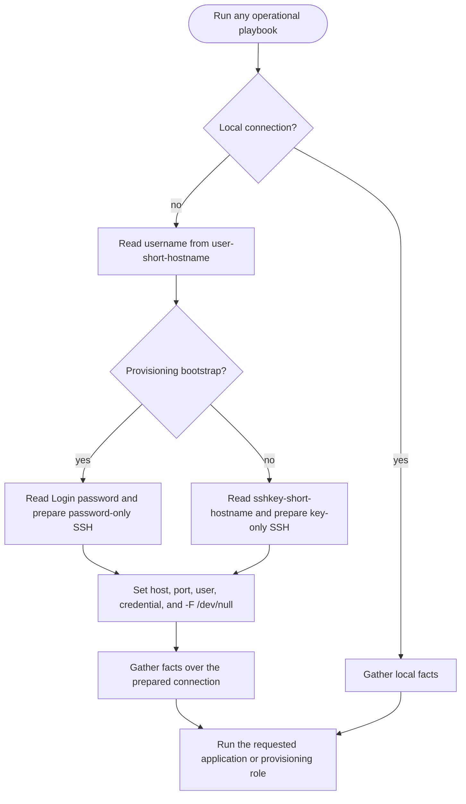
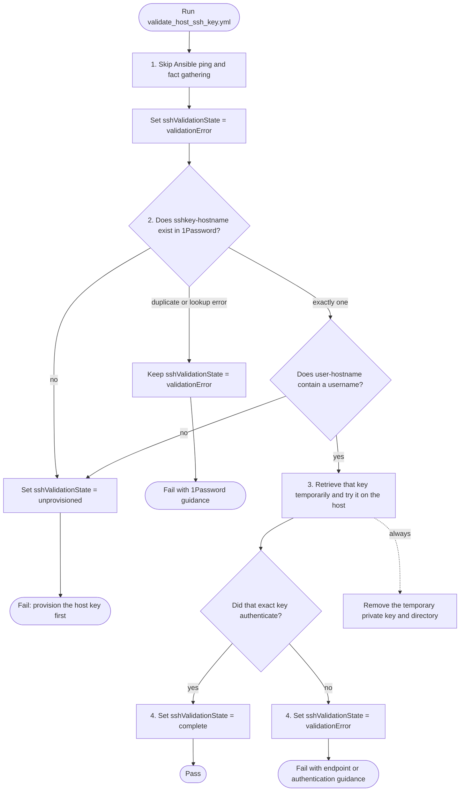

# SSH

SSH is the root capability for every remote playbook connection, reusable key
validation, and provisioning workflows. The [`ssh` role](../../roles/ssh)
resolves host credentials from 1Password before the first remote task and can
independently prove that the exact per-host key authenticates from the
controller. Key creation, installation, and password-authentication hardening remain in
[Host SSH provisioning](provision_host_ssh.md).

The validator is designed as a shared component for standalone validation and
future diagnose and rolling-SSH-key workflows. It does not change the managed
host.

## Capability segments

| Segment | Entry point | Role | Purpose |
| --- | --- | --- | --- |
| Connection preparation | Every remote playbook | `ssh` | Resolve `user-<hostname>` plus `sshkey-<hostname>` from 1Password and establish an explicit SSH connection without local SSH configuration. |
| Validation | `playbooks/validate_host_ssh_key.yml` | `ssh` | Resolve `user-<hostname>` and `sshkey-<hostname>` in 1Password, then prove that exact key on the host. |
| Provisioning | `playbooks/provision_host_ssh*.yml` | `provision_host` | Create, install, validate, and safely harden host SSH access. |

## Repository-wide connection control flow

All remote playbooks set `gather_facts: false` and invoke `ssh` first. This is
required: normal Ansible fact gathering would otherwise open SSH before a role
could establish the 1Password-backed connection.



The inventory hostname is the network endpoint unless `ansible_host` is
explicitly supplied. Only the first DNS label is used for item lookup, so
`host`, `host.local`, and `host.tailnet.ts.net` all resolve `user-host` and
`sshkey-host`.

## Validation control flow

The validation path deliberately skips an Ansible ping and fact gathering. All
work starts on the controller, and the raw SSH probe is the reachability and
authentication test.



The endpoint is frozen from the original inventory host before controller tasks
are delegated to `localhost`. This prevents delegated `ansible_host` values from
silently changing the probe target to the controller.

## State contract

Downstream inventory owns the durable value in `host_vars`:

```yaml
sshValidationState: unprovisioned
```

The value is a schema-backed string enum:

| Value | Meaning |
| --- | --- |
| `complete` | The exact private key retrieved from the selected 1Password item authenticated successfully. |
| `unprovisioned` | The expected 1Password SSH Key or Login item does not exist. |
| `validationError` | Validation could not complete, or the key, endpoint, controller, or 1Password configuration failed. |

The role writes `sshValidationState` with `ansible.builtin.set_fact`, making it
available to later plays in the same `ansible-playbook` run. It does not edit a
downstream inventory file: the downstream workflow that owns
`host_vars/<hostname>.yml` is responsible for persisting the returned state.

## Supported hosts

Validation is controller-side and does not require managed-host facts, Python,
or a particular operating system or architecture. The destination must provide
an OpenSSH-compatible endpoint reachable from the controller. The controller
must provide the `op` and `ssh` commands and a readable 1Password
service-account token.

The probe passes `-F /dev/null`, supplies the 1Password username and key
explicitly, disables the SSH agent and connection sharing, and uses a temporary
known-hosts file. Its result therefore does not depend on `~/.ssh/config`, local
identity files, agent contents, control sockets, or `~/.ssh/known_hosts`.

## Variables

See the [root variable schema](../../.schema/ansible-vars.schema.json) and its
`ssh` group for complete definitions.

| Variable | Default / source | Purpose |
| --- | --- | --- |
| `onePasswordVault` | `Personal-Automation` | Vault containing the per-host Login and SSH Key items. |
| `sshHost` | Original host's `ansible_host`, then `inventory_hostname` | Controller-resolvable validation endpoint. |
| `sshPort` | Original host's `ansible_port`, then `22` | Validation endpoint port. |
| `sshKeyItemName` | `sshkey-<short-hostname>` | Exact 1Password SSH Key item title. |
| `sshLoginItemName` | `user-<short-hostname>` | Login item containing the remote username and password. Validation reads only the username. |
| `sshOpTokenFile` | `~/.config/op/op-service-account-token` | Controller service-account token file. |
| `sshValidationOpTokenFile` | `sshOpTokenFile` | Compatibility alias for existing inventories. |
| `sshStrictHostKeyChecking` | `accept-new` | Pin the first host key for the current run and reject changes during that run. Trust resets on the next run. |
| `sshValidationTimeout` | `10` | OpenSSH connection timeout in seconds. |
| `sshValidationExtraArgs` | `[]` | Extra SSH arguments, such as a ProxyJump. |
| `sshConnectionKnownHostsFile` | `<Ansible per-run temp>/ssh-known-hosts` | Ephemeral known-host state removed when `ansible-playbook` exits. |
| `sshConnectionGatherFacts` | `true` | Gather facts after connection preparation. |
| `sshConnectionLoadBecomePassword` | `true` | Load the Login password for sudo in operational playbooks. |
| `sshValidationState` | `unprovisioned` | Downstream-maintained validation state enum. |

## Usage

Validate the exact key using only the inventory hostname and 1Password vault:

```bash
ansible-playbook playbooks/validate_host_ssh_key.yml \
  -i 'host.example.net,' \
  -e onePasswordVault=Personal-Automation
```

For inventory names `host`, `host.local`, or `host.tailnet.ts.net`, validation
reads the username from `user-host` and the private key from `sshkey-host`.
Neither `-u` nor `--ask-pass` is required, and SSH configuration is ignored.

The same invocation contract applies repo-wide. For example:

```bash
ansible-playbook playbooks/tailscale_status.yml \
  -i 'host.example.net,' \
  -e onePasswordVault=Personal-Automation
```

Operational key connections retrieve the private key into
`ansible_private_key`; ansible-core loads it into an Ansible-managed ephemeral
SSH agent. No private-key file is maintained by this repository. The connection
passes `-F /dev/null`, disables connection sharing, uses a known-hosts file
inside Ansible's per-run temporary directory, and explicitly sets the endpoint,
port, username, and accepted authentication method. The temporary directory and
managed agent are destroyed when `ansible-playbook` exits; the role does not
modify `~/.ssh` or the persistent `~/.ansible` directory.

A successful interactive `ssh host.example.net` proves that some configured
authentication path works. This playbook is stricter: it disables password,
keyboard-interactive, SSH-agent, and connection-sharing fallbacks while testing
the exact private key fetched from 1Password.

## Verification

`tests/test_validate_host_ssh_key.py` verifies the connectionless thin
playbook, original-host endpoint resolution, exact-key-only SSH flags, cleanup,
state transitions, and SSH schema coverage. The provisioning contracts verify
that hardening reuses this validator before and after changing `sshd`.

A live end-to-end run additionally requires a real SSH endpoint and readable
1Password vault, so those external systems are not simulated by the static test
suite.
