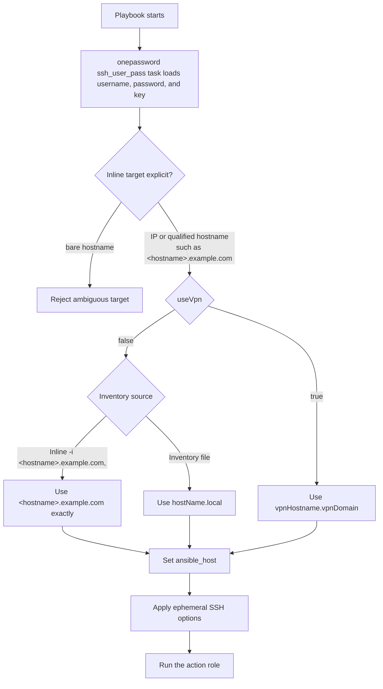

# SSH routing

Every remote playbook enters `onepassword`, then `ssh`, before its
action role. Credential resolution and routing remain separate steps.

## Inline inventory

An inline host list must provide an explicit address or qualified hostname.
Single-label names such as `hostname` are rejected because the controller's DNS
search domains could route them differently. The router does not append,
remove, or replace any part of an accepted target.

| Invocation | SSH endpoint |
| --- | --- |
| `-i '192.0.2.10,'` | `192.0.2.10` |
| `-i '2001:db8::10,'` | `2001:db8::10` |
| `-i 'hostname.local,'` | `hostname.local` |
| `-i 'hostname.tail313959.ts.net,'` | `hostname.tail313959.ts.net` |
| `-i 'hostname.example.com,'` | `hostname.example.com` |

`-i 'hostname,'` fails before a remote connection is attempted.

## Inventory file

Routing follows this precedence for every host:

- `useVpn: true` selects `vpnHostname.vpnDomain` first.
- Otherwise, an accepted inline `-i` target is used exactly.
- Otherwise, a host loaded from an inventory file selects `hostName.local`.

The inventory owns `hostName`, `vpnHostname`, `vpnDomain`, and the
`useVpn` flag.

## SSH credentials

The `onepassword` role's `ssh_user_pass` task loads the SSH username from
`<sshLoginPrefix>-<short-hostname>/username` and assigns it to `ansible_user`.
`sshLoginPrefix` defaults to `user`.

The same role loads the Login item's password into `ansible_password` and
`ansible_become_password`. It loads `<sshKeyPrefix>-<short-hostname>` from
`onePasswordVault`, requests OpenSSH format, and assigns it directly to
`ansible_private_key`. All three queries are declared in
`onePasswordSshUserPassQueries`.

The shared `onepassword` query executor reads its service-account token from
`onePasswordTokenFile`, which defaults
to `~/.config/op/op-service-account-token`. The lookup is protected by
`no_log`.

## SSH isolation

The router passes `-F /dev/null`, so it does not read `~/.ssh/config`. It uses
`/dev/null` for user and global known-host files, disables host-key persistence,
and disables SSH connection sharing and control sockets.

This framework does not validate reachability, gather facts, or add
workflow-specific safety behavior.
