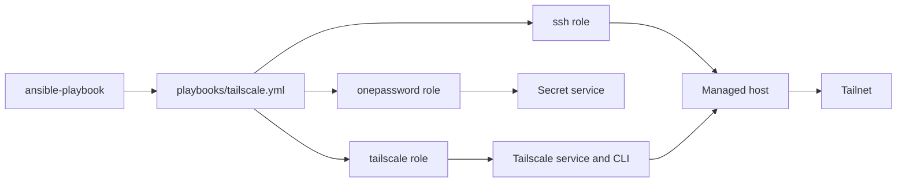
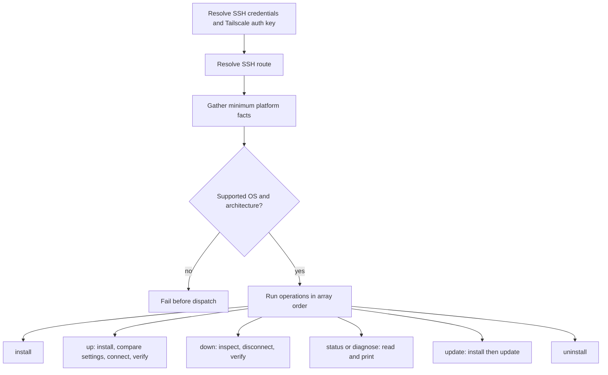

# Tailscale

## Scope

[`playbooks/tailscale.yml`](../../playbooks/tailscale.yml) and
[`roles/tailscale`](../../roles/tailscale) manage Tailscale through the
ordered, non-empty `tailscaleOperations` array. Array order is execution order.

| Operation | Result |
| --- | --- |
| `install` | Install Tailscale and verify its version. |
| `up` | Ensure installation, converge connection settings, and verify the backend is running. |
| `down` | Disconnect when needed and verify the backend is no longer running. |
| `status` | Print connection status and network diagnostics. |
| `diagnose` | Print Tailscale preferences. |
| `update` | Ensure installation and update to latest or a supported Debian version pin. |
| `uninstall` | Stop and remove Tailscale. |

The Tailscale role does not select the SSH route; [the SSH domain](ssh.md) owns
that decision.

### Supported Hosts

| OS family | Architectures |
| --- | --- |
| `Darwin` | `x86_64`, `arm64` |
| `Debian` | `x86_64`, `aarch64`, `armv7l` |

The values match Ansible facts exactly. Darwin uses Homebrew; Debian uses the
official installer. Unsupported combinations fail before dispatch.

## Goal

Use this domain to install and lifecycle-manage Tailscale, converge a host's
tailnet connection, or collect status and preference diagnostics.

## Invocation

```bash
ansible-playbook playbooks/tailscale.yml -i '<target>,' -b \
  -e onePasswordVault='<vault>' \
  -e '{"tailscaleOperations":["status"]}'
```

## Architecture



## Workflow



## Variables

Put shared non-secret coordinates in downstream `group_vars/`, host-specific
settings in `host_vars/`, and operation arrays or one-time version pins in
runtime `-e`. The resolved authentication key is sensitive, memory-only, and
is not a user-configurable variable.

| Variable | Type | Source | Default / required | Purpose |
| --- | --- | --- | --- | --- |
| `tailscaleOperations` | `array[enum]`: `diagnose`, `down`, `install`, `status`, `uninstall`, `up`, `update` | Runtime `-e` | Required; role default is `[]` | Ordered operations to execute. |
| `tailscaleAuthKeyItem` | `string` | Role default, inventory, or runtime `-e` | Configured default is redacted | Non-secret item ID. The public playbook resolves its auth key for every normal invocation; `up` consumes it. |
| `tailscaleSSH` | `bool` | Role default, `group_vars`, `host_vars`, or runtime `-e` | `false` | Enables Tailscale SSH during `up`. |
| `tailscaleVersion` | version `string` | `group_vars`, `host_vars`, or runtime `-e` | Omitted means latest | Debian update pin; at least `1.36.0`; pinning is rejected on Darwin. |
| `onePasswordVault` | `string` | Role default, inventory, or runtime `-e` | Configured default is redacted | Vault coordinate used on the control node. |

See the [variable schema](../../.schema/ansible-vars.schema.json).

## Usage

All operations require privilege escalation. Run individual operations by
changing only the array value:

```bash
ansible-playbook playbooks/tailscale.yml -i '<target>,' -b \
  -e onePasswordVault='<vault>' \
  -e '{"tailscaleOperations":["install"]}'

ansible-playbook playbooks/tailscale.yml -i '<target>,' -b \
  -e onePasswordVault='<vault>' \
  -e '{"tailscaleOperations":["up"]}'

ansible-playbook playbooks/tailscale.yml -i '<target>,' -b \
  -e onePasswordVault='<vault>' \
  -e '{"tailscaleOperations":["down"]}'

ansible-playbook playbooks/tailscale.yml -i '<target>,' -b \
  -e onePasswordVault='<vault>' \
  -e '{"tailscaleOperations":["status"]}'

ansible-playbook playbooks/tailscale.yml -i '<target>,' -b \
  -e onePasswordVault='<vault>' \
  -e '{"tailscaleOperations":["diagnose"]}'

ansible-playbook playbooks/tailscale.yml -i '<target>,' -b \
  -e onePasswordVault='<vault>' \
  -e '{"tailscaleOperations":["update"]}'

ansible-playbook playbooks/tailscale.yml -i '<target>,' -b \
  -e onePasswordVault='<vault>' \
  -e '{"tailscaleOperations":["uninstall"]}'
```

For a Debian pin, add `-e tailscaleVersion='<version>'`. A composition such as
`["install","up","status"]` runs in that exact order. The current public
playbook requests the Tailscale auth key for every normal invocation, even
though only `up` consumes it; check mode skips that auth-key read.

## Verification

- [Installer contract tests](../../tests/test_application_installers.py) and
  [Tailscale contract tests](../../tests/test_tailscale.py) verify operation
  dispatch, secret ownership, schemas, and diagnostic tasks.
- [Molecule scenario](../../roles/tailscale/molecule/default) covers the Debian
  install path: `make test-molecule-tailscale`.
- No Tailscale e2e HIL procedure exists under [`hil-test/`](../../hil-test); live
  tailnet operations, update, uninstall, ordered compositions, and Darwin remain
  an explicit verification gap.
