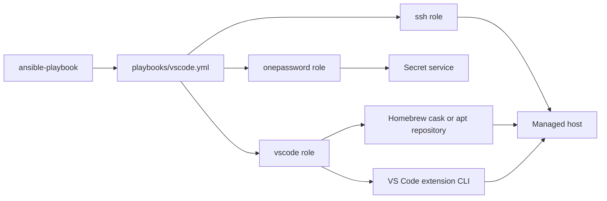
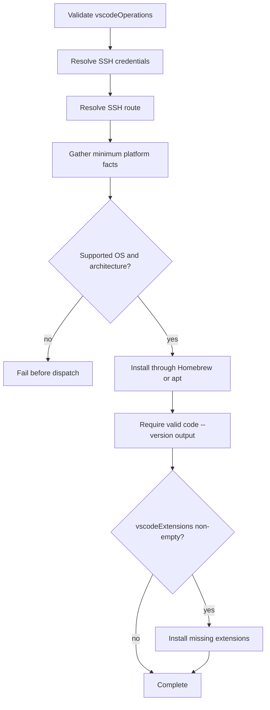

# VS Code

## Scope

[`playbooks/vscode.yml`](../../playbooks/vscode.yml) and
[`roles/vscode`](../../roles/vscode) install or update VS Code and synchronize
configured extensions through the ordered, non-empty `vscodeOperations` array.

| Operation | Result |
| --- | --- |
| `install` | Install or update VS Code, validate the CLI, and install missing configured extensions. |

The role does not remove extensions that are absent from `vscodeExtensions`.

### Supported Hosts

| OS family | Architectures |
| --- | --- |
| `Darwin` | `x86_64`, `arm64` |
| `Debian` | `x86_64`, `aarch64`, `armv7l` |

The values match Ansible facts exactly. Darwin uses the Homebrew cask; Debian
uses Microsoft's apt repository. Unsupported combinations fail before dispatch.

## Goal

Use this domain to establish a validated VS Code installation and ensure a
declared set of extensions is present on a supported workstation.

## Invocation

```bash
ansible-playbook playbooks/vscode.yml -i '<target>,' -b \
  -e onePasswordVault='<vault>' \
  -e '{"vscodeOperations":["install"]}'
```

## Architecture



## Workflow



## Variables

Put a shared extension list in downstream `group_vars/`, a host-specific
replacement list in `host_vars/`, and the operation array in runtime `-e`.

| Variable | Type | Source | Default / required | Purpose |
| --- | --- | --- | --- | --- |
| `vscodeOperations` | `array[enum]`: `install` | Runtime `-e` | Required; role default is `[]` | Ordered operations to execute. |
| `vscodeExtensions` | `array[string]` | Role default, `group_vars`, `host_vars`, or runtime `-e` | `[]` | Extension identifiers to ensure are installed. |
| `onePasswordVault` | `string` | Role default, inventory, or runtime `-e` | Configured default is redacted | Coordinate for shared SSH credential resolution. |

See the [variable schema](../../.schema/ansible-vars.schema.json).

## Usage

```bash
ansible-playbook playbooks/vscode.yml -i '<target>,' -b \
  -e onePasswordVault='<vault>' \
  -e '{"vscodeOperations":["install"]}'
```

Define extensions in downstream inventory:

```yaml
vscodeExtensions:
  - vendor.extension-one
  - vendor.extension-two
```

Preview supported changes with `--check --diff`. A successful normal run
validates that `code --version` reports version, commit, and architecture data,
then installs only missing extensions.

## Verification

- [Installer contract tests](../../tests/test_application_installers.py) verify
  operation dispatch, platform facts, schemas, and layering.
- [Molecule scenario](../../roles/vscode/molecule/default) covers the Debian apt
  installation path: `make test-molecule-vscode`.
- No VS Code e2e HIL procedure exists under [`hil-test/`](../../hil-test); Darwin and
  live extension synchronization remain an explicit verification gap.
