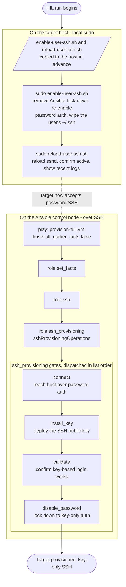

# E2E HIL Instructions for Provisioning Test

## Scope

Hardware-in-the-loop (HIL) test for the SSH provisioning role. The prep scripts return a real target host to a clean pre-provisioning state (password auth on, user's `~/.ssh` empty), then `provision-full.yml` exercises the full key-handoff on that live host: connect over password auth, install the key, validate key-based login, and disable password auth.

> **Destructive:** preparation removes the designated test account's existing
> `~/.ssh` directory. Run this procedure only on an approved HIL target with a
> recovery path and local administrative access.

## Workflow



## Instructions

### Prep the target

Copy [`enable-user-ssh.sh`](enable-user-ssh.sh) and
[`reload-user-ssh.sh`](reload-user-ssh.sh) to the approved HIL target in
advance. From a local administrative session on that target, run:

```bash
sudo ./enable-user-ssh.sh
sudo ./reload-user-ssh.sh
```

### Run script

```bash
printf 'Host: '; read -r HOST; \
export OP_ITEM="user-$HOST"; \
export OP_VAULT='Personal-Automation'; \
export SSH_FILE="sshkey-$HOST"; \
export SSH_USER="op://$OP_VAULT/$OP_ITEM/username"; \
export SSH_PASSWORD="op://$OP_VAULT/$OP_ITEM/password"; \
ansible-playbook playbooks/provision-full.yml \
  -i "$HOST.local," \
  -e "sshProvisioningUsername=$(op read "$SSH_USER")" \
  -e "sshProvisioningPassword=$(op read "$SSH_PASSWORD")" \
  -e "sshFileName=$SSH_FILE"
```


export HOST='robonb'; \
export OP_VAULT='Personal-Automation'; \
export OP_ITEM="user-$HOST"; \
export SSH_FILE="sshkey-$HOST"; \
export SSH_USER="op://$OP_VAULT/$OP_ITEM/username"; \
export SSH_PASSWORD="op://$OP_VAULT/$OP_ITEM/password"; \
op read "$SSH_USER"; \
op read "$SSH_PASSWORD"


## Success criteria

The run passes `connect`, `install_key`, `validate`, and `disable_password` in
that order. The installed key succeeds with password fallback disabled, the SSH
daemon accepts its updated configuration, and effective password and
keyboard-interactive authentication are both disabled.

## Recovery

If the workflow stops before lock-down, password authentication remains enabled.
If lock-down configuration or reload fails, the role restores and reloads the
previous SSH daemon configuration. If remote access is unavailable, use the
target's local administrative session to rerun the two preparation scripts.
