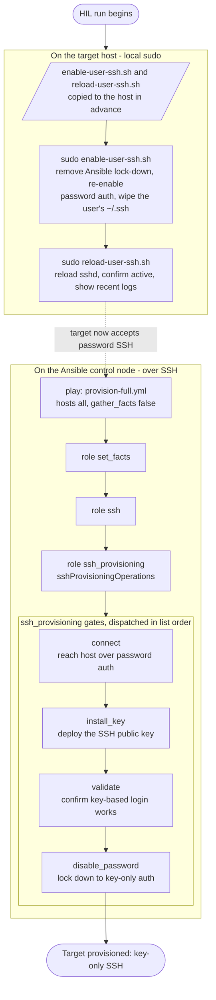

# E2E HIL Testing for Provisioning

## Scope

Hardware-in-the-loop (HIL) test for SSH provisioning: on a real target host, reset SSH back to password authentication and wipe the user's existing SSH material, then run the full provisioning playbook end-to-end to verify it connects over password auth, installs the key, validates it, and disables password login.

## Workflow



## Prep the target

Both `enable-user-ssh.sh` and `reload-user-ssh.sh` should have been copied to the host in advance.

run:
```
sudo enable-user-ssh.sh; sudo reload-user-ssh.sh
```

## Run script

```bash
ansible-playbook \
    playbooks/provision-full.yml \
    -e onePasswordVault=Personal-Automation \
    -i '<host-or-ip>,' \
    -e sshProvisioningUsername=<user> \
    -e sshProvisioningPassword=<password> \
    [-e sshFileName=<name>]
```
