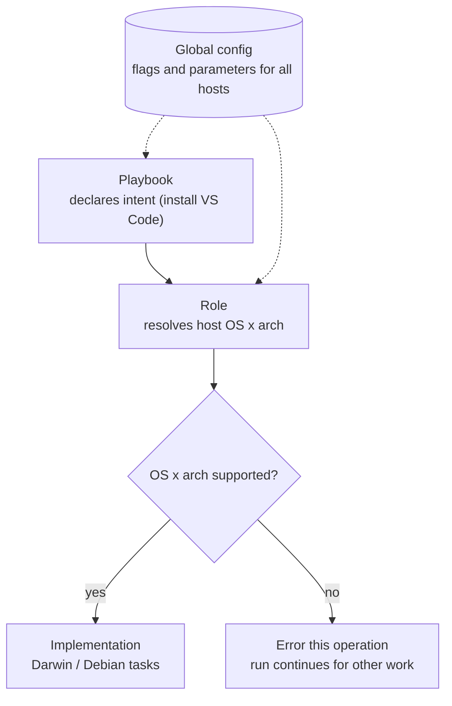

# my-galaxy-playbooks

Ansible automation for provisioning dev and production machines: the
`bergantz_galaxy.home` collection of playbooks and first-party roles, with
Molecule role tests and lint + molecule CI on GitHub Actions. Real host
inventory lives in the downstream repo that installs this collection.

## Layering

Authoring and deployment follow a mandatory three-layer model — complexity is
pushed down the stack, never smeared across playbooks:

| Layer | Owns | Concern |
| --- | --- | --- |
| Playbooks | intent | *What* to do — "install VS Code", "roll ssh keys". OS/arch-agnostic. |
| Roles | implementation | *How* to do it across the host OS × architecture matrix. |
| Global configuration | data | Flags and parameters describing hosts and features. |



The [Playbook Layering spec](.claude/specs/architecture/playbook-layering.md) is
the authoritative, must-follow contract. In short: playbooks declare intent and
never branch on OS/arch; roles are the only layer that branches on OS ×
architecture, declare their supported combinations, validate declared
`hostOperatingSystem`/`hostArchitecture` against gathered facts, and error
non-fatally on an unsupported host; global config (per-environment `group_vars`,
per-host `host_vars`) is supplied by the downstream consumer's inventory, and
role `defaults/` provide the self-contained fallbacks. Variable names are
camelCase and every variable is documented in
[`.schema/ansible-vars.schema.json`](.schema/ansible-vars.schema.json).

## Quickstart

```bash
make bootstrap   # install ansible/lint/test/molecule deps + Galaxy collections
make lint        # yamllint + ansible-lint
make check       # dry-run PLAYBOOK against INVENTORY (--check --diff)
make test        # fast: lint + syntax-check + pytest (no Docker)
make test-all    # test + all Molecule scenarios (requires Docker)
```

`INVENTORY`, `PLAYBOOK`, `LIMIT`, and `TAGS` are overridable on the CLI or via a
git-ignored `.env` (copy from `.env.example`).

## Usage notes

- To run against a host that is not in the inventory, pass it as a single-quoted
  `-i` value with a trailing comma, e.g. `-i 'host-computer-computer,'`.
- Hosts that require sudo need the become password passed as an extra var, e.g.
  `-e 'ansible_become_password=<sudo-password>'`.

e.g.
```bash
ansible-playbook playbooks/tailscale_install.yml -i 'host-computer-name,' -b -e 'ansible_become_password=<sudo-password>'
```

## Documentation

- [Repository structure](docs/structure.md) — layout and conventions.
- [Testing with Molecule](docs/testing.md) — the test-first role workflow.
- [Playbook Layering](.claude/specs/architecture/playbook-layering.md) — the
  authoring/deployment contract.

## Playbook groupings

Each toolset this repo automates has its own notes under `docs/playbooks/`:
supported hosts, variables, and example usage.

- [VS Code](docs/playbooks/vscode.md) — `playbooks/vscode.yml`
- [Tailscale](docs/playbooks/tailscale.md) — `playbooks/tailscale_*.yml`
- [Samba](docs/playbooks/samba.md) — `playbooks/samba_*.yml`
- [Claude CLI](docs/playbooks/claude.md) — `playbooks/claude_*.yml`
- [Echo](docs/playbooks/echo.md) — `playbooks/echo.yml` (variable-override validation)
