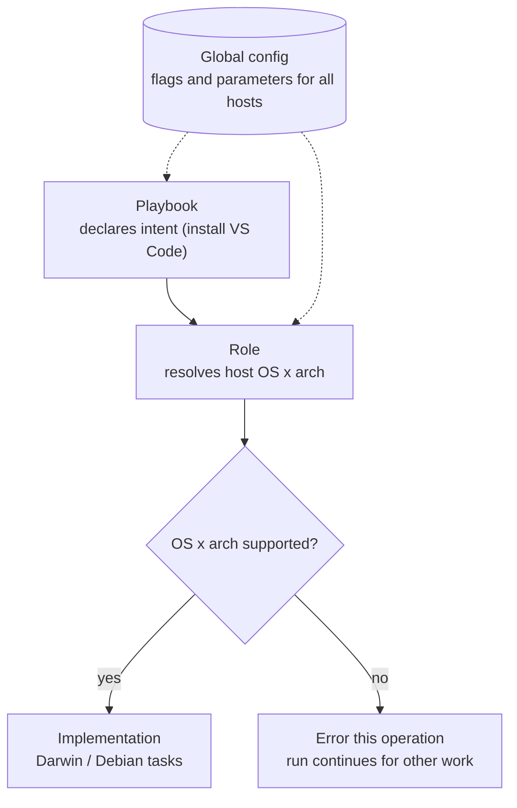

# my-galaxy-playbooks

Ansible automation for provisioning dev and production machines: the
`bergantz_galaxy.home` collection of playbooks and first-party roles, with
Molecule role tests and lint + molecule CI on GitHub Actions. Real host
inventory lives in the downstream repo that installs this collection.

## Layering

Authoring and deployment follow a mandatory three-layer model — complexity is
pushed down the stack, never smeared across playbooks:

| Layer | Owns | Concern |
| --- | --- | --- |
| Playbooks | intent | *What* to do — "install VS Code", "roll ssh keys". OS/arch-agnostic. |
| Roles | implementation | *How* to do it across the host OS × architecture matrix. |
| Global configuration | data | Flags and parameters describing hosts and features. |


```mermaid
flowchart TD
    P["Playbook<br/>declares intent (install VS Code)"]
    R["Role<br/>resolves host OS x arch"]
    D{"OS x arch supported?"}
    I["Implementation<br/>Darwin / Debian tasks"]
    E["Error this operation<br/>run continues for other work"]
    G[("Global config<br/>flags and parameters for all hosts")]

    P --> R --> D
    D -- yes --> I
    D -- no --> E
    G -.-> P
    G -.-> R
```

The [Playbook Layering spec](.claude/specs/architecture/playbook-layering.md) is
the authoritative, must-follow contract. In short: playbooks declare intent and
never branch on OS/arch; roles are the only layer that branches on OS ×
architecture, declare their supported combinations, validate gathered Ansible
fact values against those combinations, and error non-fatally on an
unsupported host; global config (per-environment `group_vars`,
per-host `host_vars`) is supplied by the downstream consumer's inventory, and
role `defaults/` provide the self-contained fallbacks. Platform dispatch uses
Ansible's gathered `os_family` and `architecture` facts directly. Variable names
are camelCase and every variable is documented in
[`.schema/ansible-vars.schema.json`](.schema/ansible-vars.schema.json).

## Quickstart

```bash
make bootstrap   # install ansible/lint/test/molecule deps + Galaxy collections
make lint        # yamllint + ansible-lint
make check       # dry-run PLAYBOOK against INVENTORY (--check --diff)
make test        # fast: lint + syntax-check + pytest (no Docker)
make test-all    # test + all Molecule scenarios (requires Docker)
```

`INVENTORY`, `PLAYBOOK`, `LIMIT`, and `TAGS` are overridable on the CLI or via a
git-ignored `.env` (copy from `.env.example`).

## Usage notes

- To run against a host that is not in the inventory, pass it as a single-quoted
  `-i` value with a trailing comma, e.g. `-i 'host-computer-computer,'`.
- Every remote playbook resolves `user-<short-hostname>` and
  `sshkey-<short-hostname>` from 1Password before its first connection. The
  Login item supplies the username and sudo password; the SSH Key item supplies
  the private key. Local `~/.ssh/config`, identities, agent keys, and known-host
  files are not used.
- Initial SSH provisioning uses the Login password. All other operational
  playbooks use the SSH key. Supply the host and vault; `-u`, `--ask-pass`, and
  an explicit `ansible_become_password` are unnecessary.

e.g.
```bash
ansible-playbook playbooks/tailscale.yml \
  -i 'host-computer-name,' \
  -b \
  -e onePasswordVault=Personal-Automation \
  -e '{"tailscaleOperations":["install"]}'
```

## Documentation

- [Repository structure](docs/structure.md) — layout and conventions.
- [Testing with Molecule](docs/testing.md) — the test-first role workflow.
- [Playbook Layering](.claude/specs/architecture/playbook-layering.md) — the
  authoring/deployment contract.

## Playbook groupings

Each toolset this repo automates has its own notes under `docs/playbooks/`:
supported hosts, variables, and example usage.

- [VS Code](docs/playbooks/vscode.md) — `playbooks/vscode.yml`
- [Tailscale](docs/playbooks/tailscale.md) — `playbooks/tailscale.yml`
- [Samba](docs/playbooks/samba.md) — `playbooks/samba.yml`
- [Claude CLI](docs/playbooks/claude.md) — `playbooks/claude.yml`
- [Ollama](docs/playbooks/ollama.md) — `playbooks/ollama.yml`
- [LM Studio](docs/playbooks/lm_studio.md) — `playbooks/lm_studio.yml`
- [Echo](docs/playbooks/echo.md) — `playbooks/echo.yml` (variable-override validation)
- [SSH](docs/playbooks/ssh.md) — shared validation and SSH capability grouping
  - [Provisioning](docs/playbooks/provisioning.md) — `playbooks/provision_host_ssh*.yml`
